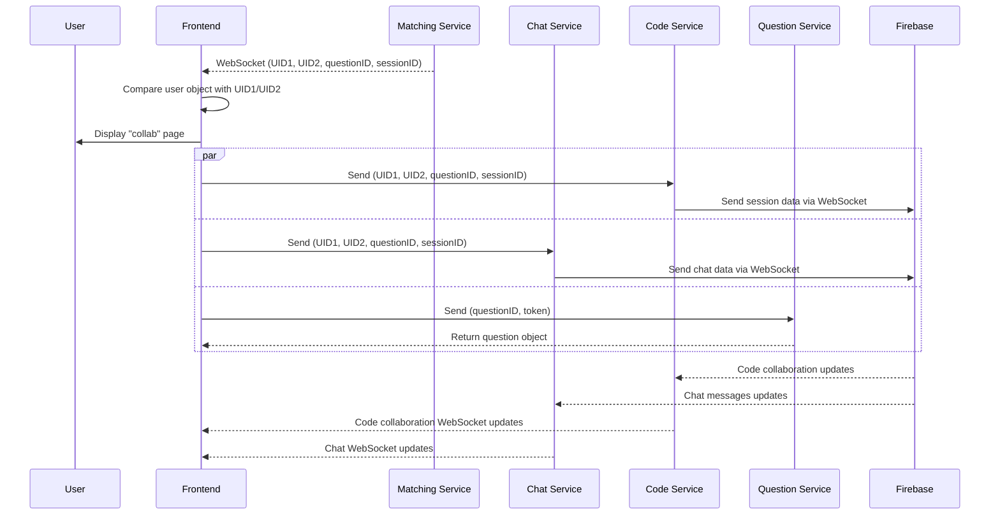

```mermaid
sequenceDiagram
    participant User
    participant Frontend
    participant Matching Service
    participant Chat Service
    participant Code Service
    participant Question Service
    participant Firebase

    %% Matching Service Notifies Frontend
    Matching Service-->>Frontend: WebSocket (UID1, UID2, questionID, sessionID)
    
    %% Frontend Updates UI and Compares User IDs
    Frontend->>Frontend: Compare user object with UID1/UID2
    Frontend->>User: Display "collab" page

    %% Frontend Sends Data to Code and Chat Services
    par
        Frontend->>Code Service: Send (UID1, UID2, questionID, sessionID)
        Code Service->>Firebase: Send session data via WebSocket
    and
        Frontend->>Chat Service: Send (UID1, UID2, questionID, sessionID)
        Chat Service->>Firebase: Send chat data via WebSocket
    and
    %% Frontend Requests Question Data
    Frontend->>Question Service: Send (questionID, token)
    Question Service-->>Frontend: Return question object
    end
    
    %% Firebase WebSockets Operation
    Firebase-->>Code Service: Code collaboration updates
    Firebase-->>Chat Service: Chat messages updates
    Code Service-->>Frontend: Code collaboration WebSocket updates
    Chat Service-->>Frontend: Chat WebSocket updates

```