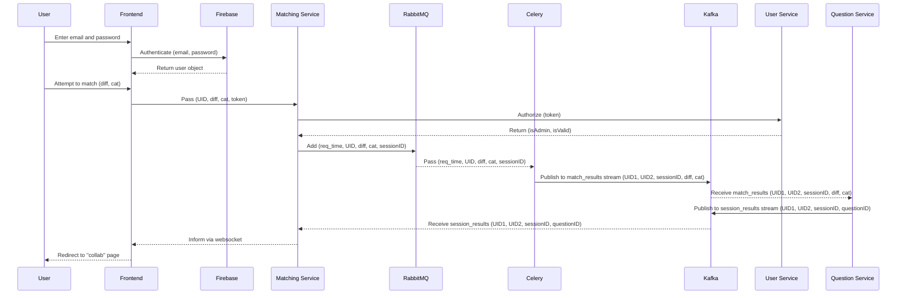

```mermaid
sequenceDiagram
    participant User
    participant Frontend
    participant Firebase
    participant Matching Service
    participant RabbitMQ
    participant Celery
    participant Kafka
    participant User Service
    participant Question Service

    %% Login Process
    User->>Frontend: Enter email and password
    Frontend->>Firebase: Authenticate (email, password)
    Firebase-->>Frontend: Return user object
    
    %% Matching Process
    User->>Frontend: Attempt to match (diff, cat)
    Frontend->>Matching Service: Pass (UID, diff, cat, token)
    Matching Service->>User Service: Authorize (token)
    User Service-->>Matching Service: Return (isAdmin, isValid)

    %% Add to Queue via RabbitMQ
    Matching Service->>RabbitMQ: Add (req_time, UID, diff, cat, sessionID)
    RabbitMQ-->>Celery: Pass (req_time, UID, diff, cat, sessionID)

    %% Celery Attempts to Match
    Celery->>Kafka: Publish to match_results stream (UID1, UID2, sessionID, diff, cat)

    %% Question Service Reacts to Kafka
    Kafka-->>Question Service: Receive match_results (UID1, UID2, sessionID, diff, cat)
    Question Service->>Kafka: Publish to session_results stream (UID1, UID2, sessionID, questionID)

    %% Matching Service Reacts to Kafka
    Kafka-->>Matching Service: Receive session_results (UID1, UID2, sessionID, questionID)
    Matching Service-->>Frontend: Inform via websocket
    Frontend-->>User: Redirect to "collab" page
 
```